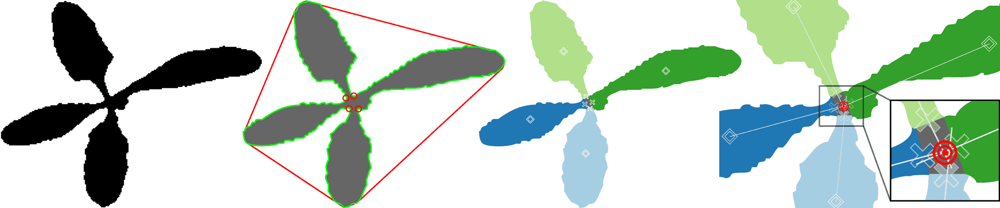

# Geometrical Stem Detection

## Description

The program allows to identify, in real-time, the stems of sugarbeets using a top-down image.

The idea is to first detect the leaves of the plant using a geometrical approach.
The stem is then derived out of the intersection of all leaf directions.



## Key contributors

* Ferdinand Langer (ferdinand.langer@uni-bonn.de)
* Leonard Mandtler (mandtler@uni-bonn.de)

## Related publications

TODO

## Dependencies

* catkin
* boost >= 1.54
* OpenCV >= 3.0
* yaml-cpp
* ROS Kinetic

## Installation guide

On Ubuntu 16.04, most of the dependencies can be installed from the package manager:
```bash
sudo apt install git libopencv-dev catkin
```

You can install yaml-cpp by following the instructions at [yaml-cpp](https://github.com/jbeder/yaml-cpp)

Additionally, make sure you have [catkin-tools](https://catkin-tools.readthedocs.io/en/latest/) installed:

```bash
sudo apt install python-pip
sudo pip install catkin_tools
```

If you do not have a catkin workspace already, create one:
```bash
cd
mkdir catkin_ws
cd catkin_ws
mkdir src
catkin init
```

Clone the repository in your catkin workspace:
```bash
cd ~/catkin_ws/src
git clone https://github.com/Photogrammetry-Robotics-Bonn/geometrical_stem_detection.git
```

Then, build the ROS nodes for vegetation segmentation and stem detection:
```bash
catkin build piros_vegsec piros_stemdet
```

## How to use it

This whole project is meant to run on a mobile ROS platform performing the stem detection.

An example bag file is provided in the `piros_stemdet/example` directory. To run
the program on the bag run:
```bash
roslaunch piros_stemdet example.launch
```

For each image, all the detected stems are published on the topic `/piros_stemdet/stem`
and printed on the terminal. For a visual representation, refer to the topic `/piros_stemdet/mask`.

For further information about the single nodes, refer to [piros_vegsec README](piros_vegsec/README.md)
and [piros_stemdet README](piros_stemdet/README.md).

## License

This project is licensed under the FreeBSD License. See the LICENSE.txt file for details.
